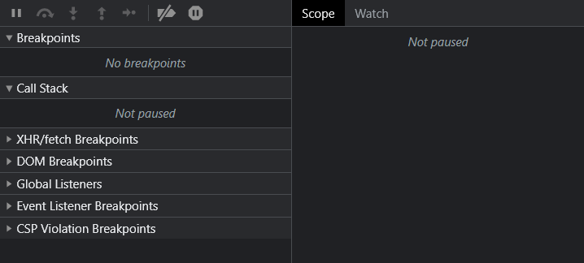
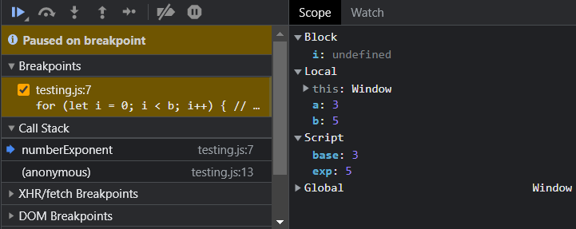

*Debugging can be quite time-consuming and painful. Reduce the pain and improve your skills with this lesson.*

# Browser Debugger

Most browsers have a built in debugger that can help debug your Javascript. To open it in chrome, open Developer tools, and then click on the Sources tab on the top. Select the file with your javascript code that you want to debug, and somewhere (depending on the orientation) you should see the debugger tools which look like this:



You may need to adjust the sizes of the debugger to see more clearly. Additionally, to open the Console while using the debugger, press the "Esc" key.      
On firefox, after you open developer tools, you should see a Debugger tab to open the debugger. On the left side of the debugger, you should navigate to the javascript file with the faulty code.         
Now let's get some broken code and attempt to debug it.

```js
const base = 3
const exp = 5

function numberExponent(a, b) { // a ^ b
// Note that this function is unnecessary and is only used for demonstration purposes
// a ** b in Javascript is the equivalent of a ^ b
	for (let i = 0; i < b-1; i++) { // loop through b-1 times
		a *= a // a = a * a
	}
	return a
}

console.log(numberExponent(base, exp)) // should be 243
```

This file does 3^5, which should be `243`. However, when we actually run the code, we see that we get `43046721`, way over the correct answer. You may or may not see the actual error in the code, but for demonstration we will use the debugger to figure it out.

## Breakpoints

Breakpoints are a line of code where the debugger stops the program. To add a breakpoint, click on a line number on the javascript file. The line number should turn blue and should get a blue background. When the debugger is paused, we can examine the variables and their current values and also execute our own commands in the console. Let's try adding a breakpoint at line 7 and refreshing the page.    

We should get a debugger that looks similar to this



We can see that the script is currently paused on a breakpoint, and we can see all the breakpoints we have set in the section underneath. When at the breakpoint, the current line has not been executed. So, in our script, line 7 has not been run yet so the `i` variable is still not defined.

Under that we can see the "Call Stack", which basically traces which functions have been called. We can see that we were on line 13 on the javascript file, then called the function `numberExponent`, which led us to line 7 where the program paused at the breakpoint.     

On the right side of the debugger we can see the Scope of all the variables. We didn't go over scope here, so you can read more about it [here](https://developer.mozilla.org/en-US/docs/Glossary/Scope). In basic terms, local scope are variables only defined in the function, which would be `a` and `b` from line 4. Script variables are variables defined in the script, which are `base` and `exp` defined on lines 1 and 2.     
We can also open the watch tab on the right side of the debugger. Currently, it will say "No watch expressions", but we can add some by pressing the plus button. Let's watch the variable `a`, which should be the `3` right now.      

<TipBox>

We can also add a line in our script that says
```js
debugger
```
then the script will pause there only if developer tools is open. If not, the script will ignore the line.

</TipBox>

## Continuing Execution

Now let's continue the execution and watch where our code goes wrong. On the top of the debugger, we can find multiple buttons that will continue the execution of the function in different ways. Depending on the browser you are using, the buttons will be different. However, you can hover over them and see what they do.

### Resume Script Execution

Pressing this button will just resume the script and let it continue running until it either reaches another breakpoint or until the end of the script. For our situation right now, it is not useful as we would be skipping over the loop and won't figure out why our code is giving us the wrong answer.

### Step

This button will run the next statement. We will be pressing this button and watching our variables change, trying to diagonose our issue. 

### Step over next function call

This button is similar to the "Step" command, however if there is a function call on the next line, it will not step into the function call and instead just execute the function itself. This is useful when you want to skip over a long function you know will work and don't want to waste time stepping over a long function. 

### Step into next function call

If you are stopped on a line that will call a function, this will cause you to step into a function call. 

### Step out of current function

When pressing this inside a function, it will finish the execution of the function and then returning and pausing at the calling function.

Let's press the "Step" function multiple times and see what happens. We can see that the `i` variable changes from `3` to `9` then to `81`, which is the source of our error. We should be going from `3` to `9` to `27`, but since we are doing `a * a`, we get 81. So, we thanks to our debugger, we can fix our code by doing:

```js
const base = 3
const exp = 5

function numberExponent(a, b) { // a ^ b
// Note that this function is unnecessary and is only used for demonstration purposes
// a ** b in Javascript is the equivalent of a ^ b
	for (let i = 0; i < b-1; i++) { // loop through b-1 times
		a *= base // a = a * base
	}
	return a
}

console.log(numberExponent(base, exp)) // we get 243 now
```

# Improving Your Site

## Inspect Element

Sometimes your HTML/CSS won't work properly and your site will look funky. Using Inspect Element can allow you to quickly mess around with the styling of your site and see what fixes it. When you click on an element on the Inspect Element screen, on the bottom of Developer Tools you can see the element's styles, along with its classes and ID's. 

## Google Lighthouse

A helpful tool to evaluate your site is using Google Lighthouse, which can be found on a tab of Google's Developer Tools. Pressing on the "Analyze page load" button will cause Google to evaluate your site and give you a score. From there, you can see what parts of the site you can improve on.
