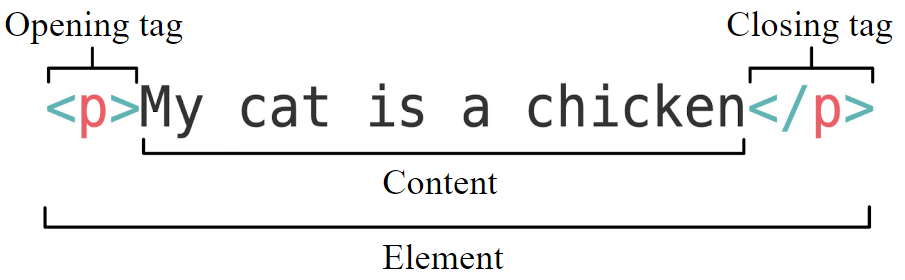

Hypertext Markup Language, commonly known as HTML, is the language we use to create web pages. In this lesson, we will learn the basics of HTML and create our first webpage!

# Setting Up

Firstly, if you haven't already, you will need to install a code editor. Some popular code editors are [Visual Code Studio](https://code.visualstudio.com/), [Sublime Text](https://www.sublimetext.com/), and [Atom](https://atom.io/).
After following the installation instructions on their website, open it and create a new file. You can name the file whatever you want, as long as the file extension is `.html`.

# Now Let's Start Coding

Alright! Let's create our first webpage. First, let's go over the basics of HTML. In HTML, we have elements that consists of an opening tag, content, and closing tag, as shown in the image below (credit MDN Web Docs). 





The opening tag contains the name of the element (which is `html›p` here) and is wrapped in opening and closing angle brackets. The closing bracket is the same, except it has a slash in front of the element name indicating that that the element ends there. The content is the content between the opening and closing tags, which in this case is just text, but it can be other elements as well.  

## Attributes

Attributes in HTML are additional values put inside the opening tag of an HTML element to configure and adjust them. An example can be found in the picture below (credit MDN Web Docs)


Some common attributes we will use are going to be the `html›id` and `html›class` attributes that we will introduce in the next lesson.

## <!DOCTYPE>

The first thing we will add in our file is the `html›<!DOCTYPE>` declaration. This tells our browser what version of HTML our web page is written in. Since we are using the latest version of HTML, we will add `html›<!DOCTYPE html>` to our file.

## The HTML Tag

So, after adding the `html›<!DOCTYPE>` declaration, we can add our first element: the HTML element, which will represent the entire HTML document. To add this, add `html›<html>` to your file. Depending on your code editor and its settings, the closing tag (`html›</html>`) will be added automatically. If it does not, you should add it at the end of your file yourself.

## The Head Tag

The `head` element, which is what we will add next, is used to contain metadata, or the information about the webpage. For example, we can add a `title` element to the `head` element, which will contain the title of the webpage. In addition, we can add styles, scripts, and other metadata here, but we will just stick with the title element for now.    
To add that, add the opening tag `html›<head>` to your file (and the closing tag if it doesn't get added correctly) and the title of the page in between the two tags. So, your code now should look like:
```html
<!DOCTYPE html>
<html>
    <head>
        <title>My First Web Page</title>
    </head>
</html>
```


<TipBox>
Use indents when having **nested elements** (elements that are inside elements) as shown above to help clean up your code and easily find where a certain element opens and closes.
</TipBox>


## The Body Tag

We will then add the `body` element using the `html›<body>` and `html›</body>` tags. This element will contain the content of our HTML document. 
Let's first add a small paragraph inside the body element by using the `html›<p>` and `html›</p>` tags. Your code now should look something like this:

```html
<!DOCTYPE html>
<html>
    <head>
        <title>My First Web Page</title>
    </head>
    <body>
        <p>This is my first web page!</p>
    </body>
</html>
```

To look at the result, open the webpage! One way to do this is to find the file in your folders, and then right click on it and open it with your browser of choice.


Congratulations! You just created your first website! In the next section, we will be introducing more HTML elements.

# More HTML Elements

We recommend that you try these elements out on your webpage to get used to them.

## Headings

There are six different sized headings in HTML, from `html›<h1>` to `html›<h6>`. The `h1` element is the largest heading, and the `h6` element is the smallest. The "Headings" title here is an example of the `h2` element, and the "More HTML Elements" title is an example of the `h1` element.

## Font Styles

To get **bold** text, surrond the text with `html›<b>` tags. To get <i>italic</i> text, surround the text with `html›<i>` tags. To get <u>underlined</u> text, surround the text with `html›<u>`.

## Tables

Tables in HTML consists of table rows, which contain table cells. To create a table element, add the `html›<table>` tag. Then, for each row, add a `html›<tr>` tag and inside that add a `html›<td>` tag to create a table cell.         

```html
<table>
    <tr>
        <td>A</td>
        <td>B</td>
        <td>C</td>
    </tr>
    <tr>
        <td>D</td>
        <td>E</td>
        <td>F</td>
    </tr>
</table>
```

will render the table

<table>
    <tr>
        <td>A</td>
        <td>B</td>
        <td>C</td>
    </tr>
    <tr>
        <td>D</td>
        <td>E</td>
        <td>F</td>
    </tr>
</table>

Unfortunately, this table doesn't have any borders yet! But we can fix that in the next lesson when we learn about CSS.

### Table Headings

To add header cells in your table, simply use the `html›<th>` for each heading cell instead of the `html›<td>` tag.

```html
<table>
    <tr>
        <th>A</th>
        <th>B</th>
        <th>C</th>
    </tr>
    <tr>
        <td>D</td>
        <td>E</td>
        <td>F</td>
    </tr>
</table>
```

will render the table

<table>
    <tr>
        <th>A</th>
        <th>B</th>
        <th>C</th>
    </tr>
    <tr>
        <td>D</td>
        <td>E</td>
        <td>F</td>
    </tr>
</table>

### Column Spanning

To make a table row span multiple columns, we will use the `html›colspan` attribute. Simply add this attribute along with the number of columns it should span to the correct table cell and it should work! 

```html
<table>
    <tr>
        <th>A</th>
        <th>B</th>
        <th>C</th>
    </tr>
    <tr>
        <td>D</td>
        <td>E</td>
        <td>F</td>
    </tr>
</table>
```

will render the table

<table style="border: 1px solid black;">
    <tr style="border: 1px solid black;">
        <th colspan='2' style="border: 1px solid black;">A</th>
        <th style="border: 1px solid black;">C</th>
    </tr>
    <tr style="border: 1px solid black;">
        <td style="border: 1px solid black;">D</td>
        <td style="border: 1px solid black;">E</td>
        <td style="border: 1px solid black;">F</td>
    </tr>
</table>

Your code won't have the borders show up, but don't worry! We will learn that in the next lesson. They are just added here to help visualize that the first table spans two columns.

## Lists

There are two types of lists: ordered (numbered lists) and unordered (bulleted lists).      
To create an **o**rdered **l**ist, first use the `html›<ol>` tag and then for each **l**ist **i**tem add the `html›<li>` tag.

```html
<ol>
    <li>Item 1</li>
    <li>Item 2</li>
    <li>Item 3</li>
</ol>
```

<ol>
    <li>Item 1</li>
    <li>Item 2</li>
    <li>Item 3</li>
</ol>

To create an **u**nordered **l**ist, first use the `html›<ul>` tag and then for each **l**ist **i**tem add the `html›<li>` tag.

```html
<ul>
    <li>Item 1</li>
    <li>Item 2</li>
    <li>Item 3</li>
</ul>
```

<ul>
    <li>Item 1</li>
    <li>Item 2</li>
    <li>Item 3</li>
</ul>

## Divisions

Another extremely common HTML element is the `html›<div>` tag. This tag is used to create a division or section in your webpage. They don't really do anything at first; however, after we add styling to these divs, they can be extremely powerful in the design of the webpage.

## Spaces

HTML ignores whitespace, so 

```html
<p>        any                    spacers?</p>
```

will show up as

<p>        any                    spacers?</p>

which can be unintended behavior. Instead, to add whitespaces, use `html›&nbsp;` to create a space.

```html
<p>&nbsp;&nbsp;&nbsp;any&nbsp;&nbsp;&nbsp;&nbsp;&nbsp;&nbsp;&nbsp;spacers?</p>```
```

will show up as

<p>&nbsp;&nbsp;&nbsp;any&nbsp;&nbsp;&nbsp;&nbsp;&nbsp;&nbsp;&nbsp;spacers?</p>

But keep in mind however, there are many other alternatives to add whitespace that we will go over in later lessons, so the use of `html›&nbsp;` should be used sparingly and only when it is absoultely necessary.

## Comments

These aren't really an HTML tag, but they are still important to know! Comments are lines of code that the computer ignores, so they are usually used to describe the function of certain chunks of code. To comment lines of code in HTML use `html›<!--` to open the comment and `html›-->` to close the comment.

<br />

<OtherInfo>
Of course there's a lot more to HTML than this, but this lesson is just covering the basics! You can find so much more information online using a simple google search, or through using helpful resources such as [W3Schools](https://w3schools.com/) and [MDN Web Docs](https://developer.mozilla.org/en-US/).
</OtherInfo>

Congratulations on creating your first webpage! In the next lesson, we will begin using Cascading Style Sheets (CSS), which helps you style and design your webpage.
