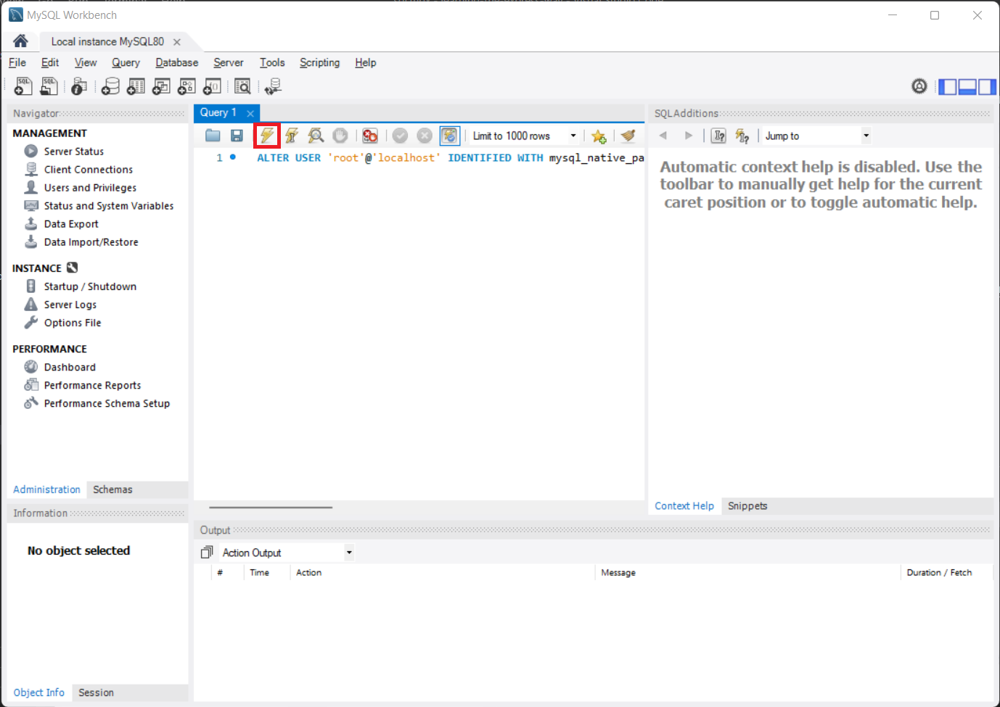

*In this lesson, we begin storing data into databases.*

# Installation

SQL stands for Standard Query Language, which is the language used to communicate to databases and allows developers to add, modify, delete, and retrieve data from a database. There are many different SQL libraries for Express; on this site, we will be using [MySQL](https://www.mysql.com/). You can download MySQL [here](https://dev.mysql.com/downloads/mysql/). 

<OtherInfo>

Nowadays, NoSQL databases such as mongoDB are gaining popularity as well. Unfortunately we won't cover them here, but you can find more information about them [here](https://www.mongodb.com/).

</OtherInfo>

If you will not be using SQL on your local machine, you can skip this section. You will find instructions to use SQL on Director at the bottom of this section.
The following is a video tutorial on how to install it for Windows, and on other operating systems the steps should be similar. If videos aren't your thing, a step by step instruction can be found below the video.

<br />

{{video: https://www.youtube.com/watch?v=WuBcTJnIuzo}}

1. Before your download, if you are prompted too a log in to Oracle page, you can just press the "No thanks, just start my download" button at the bottom to skip it. 
2. In the installer, agree to the terms and condition and when prompted to choose a setup type, select the "Developer Default" option. 
3. On the next step, you may have a pop up that claims that some of the product requirements have not been satisfied. If this is the case, press the "Execute" button at the bottom of the installer. This will cause MySQL to try to resolve these issues by itself by installing the correct programs, resolving most of the issues. There will probably still be some products that have missing requirements, but they usually will not be important and you can conintue on to the next step. 
4. Then, on the "Installation" page, press "Execute" to install the MySQL products, which will take a few minutes.       
5. We will now need to configure the products. On the Type and Networking page, in the Connectivity section, you have multiple connection options. The default selection of `TCP/IP` with port `3306` works well, but if for some reason you will need to change the port feel free to do so. However, please remember the port number as it will be important later.
6. Choose the strong password encryption option and then on the next page you are prompted to create a password. Remember this password as well!
7. We can continue on to the next steps and use the default options provided by the MySQL installer.
8. On the Apply Configuration tab, press "Execute" and wait for the steps to finish.
9. On the "MySQL Router Configuration" page, just press "Finish"
10. For the next step, you can check your connection to the server by entering your username (`root`) and password (the password you created earlier) into the MySQL prompt. After that, press "Next" and then "Execute".
11. Continue pressing "Next" and then finish the installation.

Now, we should now create a database. Open up MYSQL Command Line Client, enter the root password you made earlier, and then run the command `CREATE DATABASE [NAME];`, where `[NAME]` is the name of your new database (such as the name of your project). Also notice the semicolon at the end of the statement; they are necessary for the command to work. To use this database in the command line, run the command `USE [NAME];`.

<DirectorBox>

Setting up a database in director is actually quite easy! On the right side of the site settings screen, there should be a button to "Add Database". Choose the MySQL host and then "Create Database". Your database has now been created, and further instructions to connect your application to the database can be found in the Combining SQL and Express section.

</DirectorBox>

# SQL Commands

We use SQL queries to actually do stuff in our databases. These queries can be used inside the MySQL Command Line Client, so feel free to try them out now!

To create a SQL Table, we will use the following command
```sql
CREATE TABLE tablename(col1 TYPE, col2 TYPE, col3 TYPE, ..., PRIMARY KEY (col1));
```

`tablename` is the name of the table, `col1, col2, ...` are the names of the columns of the table, and `TYPE` is the type of the column (`INT`, `VARCHAR(SIZE)`, `BOOL`, `DOUBLE`, `DATE`, ect.). The `PRIMARY KEY(col)` is optional and can be omitted. A primary key column is used to uniquely identify a row in the table; no duplicate values are allowed in the `col` specified.    

To alter a table, use the command
```sql
ALTER TABLE tablename [ADD/DROP] COLUMN colname;
```
if we are adding/deleting a column, and 
```sql
ALTER TABLE tablename MODIFY COLUMN colname coltype;
```
to change the datatype of a column.

To delete a SQL table, use
```sql
DROP TABLE tablename;
```

To insert a row of into a table, we use
```sql
INSERT INTO tablename (col1, col2, ...) VALUES (val1, val2, ...);
```
The `(col1, col2, ...)` in the middle is not necessary if your command will be inserting a value into each column in the table. Otherwise, it is necessary to specify which columns the row you are adding to the table has.

To delete data from a table, we use
```sql
DELETE FROM tablename WHERE condition;
```
where `condition` is the condition that the row must meet to be deleted. The `WHERE` clause is not necessary. So for example, if we are deleting all the rows where 'age' is less than 18, we would do
```sql
DELETE FROM tablename WHERE age < 18;
```

To update some data from a table, use
```sql
UPDATE tablename SET col1 = val1, col2 = val2, ... WHERE condition;
```
where again `condition` is the condition that the row must meet to be updated and the columns will be set to the value specified. The `WHERE` clause is not necessary.     

To retrieve data from a table, we use 
```sql
SELECT col1, col2, ... FROM tablename WHERE condition;
```
The columns can be replaced with `*` to select all columns. So if we want to select all the rows from a table, we would do
```sql
SELECT * FROM tablename;
```

Finally, to retrieve the minimum, maximum, count, average, or sum of a column, we use 
```sql
SELECT MAX(colname) FROM tablename WHERE condition;
```
except replace MAX with MIN, COUNT, AVG, or SUM to get the minimum, count, average, or sum of the column, respectively.

<OtherInfo>

Again, these are just the basic commands that you will be using the most. Some other important commands and concepts are `sql›UNION`, `sql›JOIN`, and the wildcard symbols, and you can read a more detailed documentation of SQL commands [here](https://www.w3schools.com/sql/sql_syntax.asp). 

</OtherInfo>

# Combining SQL and Express

Now we need to install the `mysql` package for our web application. In our terminal, run `npm i mysql` and then at the top of our javascript file add `js›const mysql = require('mysql')`. Then, in our file, to connect to the server, add the following lines:

```js
const pool = mysql.createPool({
  user: 'root',
  password: [PASSWORD],
  host: '0.0.0.0',
  port: '3306',
  database: [DATABASE]
})
```

where `[PASSWORD]` is the password you created earlier and `[DATABASE]` is the name of the database you created earlier. Additionally, change the port if you changed it from the default value of `3306` earlier.

<TipBox>

If you are pushing your code to the public, such as in a git repository, it is a good idea to keep some information, such as your passwords, secret and out of the public. We can use `env` to store these values in a file called `.env` in the root directory of our project. To do this, we first install the `dotenv` package by doing
```
npm i dotenv
```
Then, create a file `.env` and start storing your variables such as
```
VARIABLE_NAME=value
VARIABLE_NAME_2=value2
```
Then, in our javascript file, add `js›require('dotenv').config()` in the beginning to load the variables from the file. Finally, replace the variables with `process.env.VARIABLE_NAME` in our code.

</TipBox>

<DirectorBox>

When connecting to the SQL database on director, use the following lines instead:
```js
const pool = mysql.createPool({
  user    : process.env.DIRECTOR_DATABASE_USERNAME,
  password: process.env.DIRECTOR_DATABASE_PASSWORD,
  host    : process.env.DIRECTOR_DATABASE_HOST,
  port    : process.env.DIRECTOR_DATABASE_PORT,
  database: process.env.DIRECTOR_DATABASE_NAME
})
```

</DirectorBox>

Now, let's make queries! To do so, we use the `query()` function, like so:

```js
pool.query('SELECT * FROM leaderboard', (err, res) => { // selects all rows from the leaderboard table
  if (err) {
    console.log(err) // if there is an error, log the error in console
  } else {
    console.log(res) // otherwise, log the result of the query (all the rows from the leaderboard table)
  }
})
```

Now with your knowledge of SQL, you can do many powerful things. Let's create a counter that is stored in a table, and visiting `/` displays the counter, `/add` increments the counter, and `/minus` decrases the counter.     

So, let's first make a table called `counter` with a column called `count` with datatype `INT`. To do that we will run the following command in the SQL Command Line Client:
```sql
CREATE TABLE counter(count INT);
```

Then, we will insert a row into the table with the value `0` in the `count` column. To do that, we will use the following command:
```sql
INSERT INTO counter VALUE (0);
```

Next, in our javascript file we will add the three middleware functions

```js
function addCounter(req, res, next) {
  pool.query('UPDATE counter SET count=count+1;', function(e, r) { // adds 1 to counter
    next()
  })
}

function minusCounter(req, res, next) {
  pool.query('UPDATE counter SET count=count-1;', function(e, r) { // minus 1 to counter
    next()
  })
}

function getCounter(req, res, next) {
  pool.query('SELECT * FROM counter;', function(e, r) { // retrieve data from counter
    res.count = r[0].count // notice how we are using the res object
    next()
  })
}
```

We will then add the following three endpoints

```js
app.get('/', [getCounter], function(req, res) {
  res.render('index', {count: res.count}) // using res.count here in the input object
})

app.get('/add', [addCounter], function(req, res) {
  res.redirect('/') // after adding using addCounter(), we will redirect to the index page
})

app.get('/minus', [minusCounter], function(req, res) {
  res.redirect('/') // after subtracting using minusCounter(), we will redirect to the index page
})
```

Then in our `hbs` file we will add

```handlebars
<p>Counter: {{count}}</p>
```

You may run into the error
```
Error: ER_NOT_SUPPORTED_AUTH_MODE: Client does not support authentication protocol requested by server; consider upgrading MySQL client
```
when trying to run this for the first time. To fix that, open MySQL Workbench and select on the local instance. You will be prompted to enter in your password from before. Inside the query box, enter
```sql
ALTER USER 'root'@'localhost' IDENTIFIED WITH mysql_native_password BY 'PASSWORD';
```
where `PASSWORD` is the password you created earlier. Then, execute the query by selecting on the lightning bolt symbol, as shown in the picture below.



Then, replace the query with
```sql
flush privileges;
```
and execute again. Try running the server now; it should work. Try visiting `/add` and `/minus` to see the counter change. If it does not work, the `index.js` and `index.hbs` have been provided below. Also, check to see if your SQL query comamnds were run correctly!

```js
// index.js
const express = require('express')
const app = express()
const hbs = require('hbs')
app.set('view engine', 'hbs')

const mysql = require('mysql')

const pool = mysql.createPool({
  user: 'root',
  password: [PASSWORD],
  host: '0.0.0.0',
  port: '3306',
  database: [DATABASE],
})

function addCounter(req, res, next) {
  pool.query('UPDATE counter SET count=count+1;', function(e, r) { // adds 1 to counter
    next()
  })
}

function minusCounter(req, res, next) {
  pool.query('UPDATE counter SET count=count-1;', function(e, r) { // minus 1 to counter
    next()
  })
}

function getCounter(req, res, next) {
  pool.query('SELECT * FROM counter;', function(e, r) { // retrieve data from counter
    res.count = r[0].count // notice how we are using the res object
    next()
  })
}

app.get('/', [getCounter], function(req, res) {
  res.render('index', {count: res.count}) // using res.count here in the input object
})

app.get('/add', [addCounter], function(req, res) {
  res.redirect('/') // after adding using addCounter(), we will redirect to the index page
})

app.get('/minus', [minusCounter], function(req, res) {
  res.redirect('/') // after subtracting using minusCounter(), we will redirect to the index page
})

app.listen(3000, () => {
  console.log(`Example server started`)
})
```

```handlebars
<!-- index.hbs -->
<!DOCTYPE html>
<html>
    <head>
        <title>SQL</title>
    </head>
    <body>
        <p>Counter: {{count}}</p>
    </body>
</html>
```

<Warning>

As you begin working on bigger projects, you might want to check out the dangers of [SQL Injection](https://developer.mozilla.org/en-US/docs/Glossary/SQL_Injection) and ways to prevent it.

</Warning>

To recap, in this lesson we learned basic SQL and made a project that used a SQL table to increment and decrement a counter. Now, this was just a simple example of the power of databases. There are many other uses, such as storing user data submitted from forms. In the next lesson, we will begin using cookies, another powerful tool in web.
